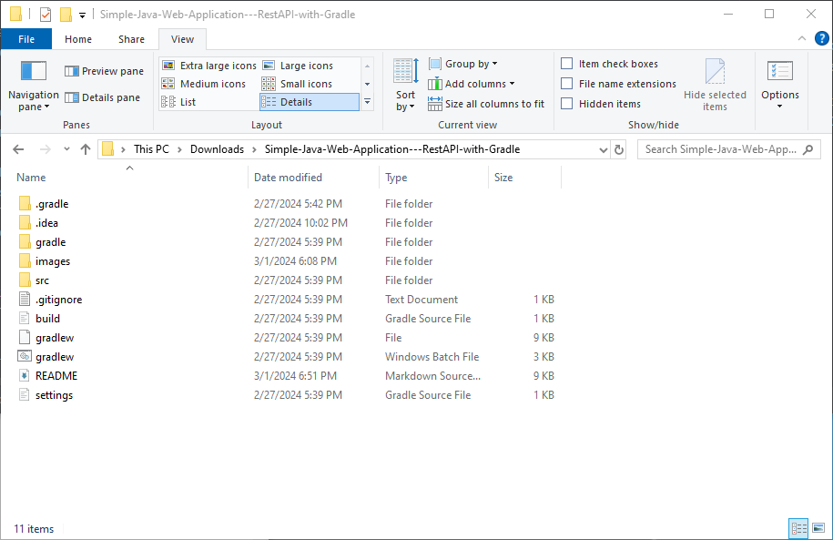
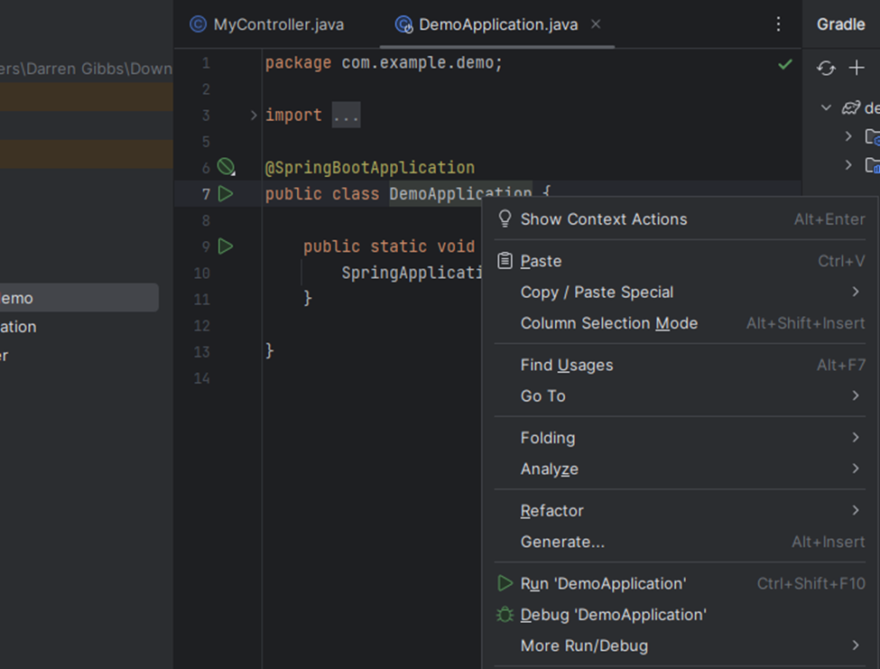

# Simple Java Web Application - RestAPI with Gradle:
In this exercise, you will be introduced to three items - a build tool, a new IDE and working with two Java RestAPI.  To start, fork this repository to your own GitHub account.

When the fork is completed, clone the project to your computer with `git clone` command to a directory of your choice on your computer (I cloned mine directly to the ***Downloads*** directory which shown throughout this document).

The content of the project ***Simple-Java-Web-Application---RestAPI-with-Gradle*** should look like the following (the screenshot below is with Windows 10 File explorer. Windows 11/Mac OS show something similar):

    

Required software to complete all parts of this exercise:
* Internet – to pull in dependencies (web libraries) for the project to be built/compiled successfully.
* JDK – use the version installed with BlueJ (JDK 17).  You can choose a different or higher version of JDK if you have them installed.
* JAVA_HOME – environment variable set with the path to where the JDK is installed.
* GitBash – installed as part of Git and you might have used it in one of the previous labs.
* IntelliJ – download the installer from JetBrains and install it on your computer.  If you download the education version, no activation is required.  The commercial version requires activation of license.  As a PCC student, you can request for an education license (expires in a year).
* Browser – Chrome, Edge, Firefox, etc.

-----
## Working with a build tool.
The build tool you are working with is Gradle.  In this project directory, Gradle is already set up.  Notice there is a file – gradlew – this is the file you will use to build and start the Java web application.

If you are working with Windows’ file explorer, navigate to the ***Simple-Java-Web-Application---RestAPI-with-Gradle*** project root directory as shown in the first screenshot of this document.  Right click and select GitBash.  (Mac has a similar technique for these steps.  Consult with the Internet as the author does not have access to a Mac).

This automatically starts GitBash with the command line inside of the demoGradle project root directory.

Next, set JAVA_HOME if not already set.  After confirming that JAVA_HOME is set, type the following and press enter:  `bash gradlew bootRun` (the screenshot below shows author’s JAVA_HOME set to author’s BlueJ JDK installed location, your JDK installed location may be different)

The above command will build the Java project where the source code is in src directory and pull in all required dependencies from the Internet.  Gradle will transition from build to running the project when the build is successful.  This includes starting Apache Tomcat (web services), binding port 8080, and starting the web application (DemoApplication).

Open a browser tab when you see “Started DemoApplication…”

Type the following in the URL/search box:  `http://localhost:8080/greeting`

You will get a response from the web application that looks like this:

    

Type the following in the URL/search box:  `http://localhost:8080/greeting?name=Jack Reacher`

**Type a URL similar to the one above using your own name. Take a screenshot similar to the one above, showing the greeting end point greeting you by name. Submit this screenshot to show you completed this part of the lab.**

Return to GitBash and press CTRL-C to stop the web application.

You can also run this Java web application’s jar file created by the Gradle build tool in build/libs directory with the following command: `java -jar build/libs/demo-0.0.1-SNAPSHOT.jar`

If you like, open up the browser to go through the above examples.

Good!  You have used Gradle to build and run an example Java web application project.

-----
## Working with IntelliJ IDE
Download and Install IntelliJ IDE

Start this portion of the exercise by visiting JetBrains website and download the current version of IntelliJ.  (Note – this is a commercial version that would need a license to activate.  As a PCC student, you can request an education license with proof – expires in a year and can be renewed.)  Or you can download the education version of IntelliJ with many features that are removed and does not require a license to activate it.

Open the demoGradle project in IntelliJ IDE

In this portion of the exercise, you will have a quick exploration of the IntelliJ IDE.  You will work with IntelliJ IDE in CIS 233J Java Programming II.

Click the open button on the IntelliJ Splash window to open the Java web application.  (Your splash window may look different)

On the next window navigate to the DemoGradle project root directory (contains gradlew file and the src directory) to populate the path/location entry.  Press OK to proceed to the next step.

Click on Open as Project to bring the Java web application into IntelliJ

You may encounter a dialog box prompting you to trust and open the project. Click 'Trust Project' to proceed.

You are encouraged to read a few of the tips working with IntelliJ in the tip window.  When ready, dismiss the tip window and click the folder icon.  This would minimize or restore the project structure.

Let’s make sure the project SDK is set.  First let’s expand the Main Menu, select File dropdown menu, and select Project Structure.

In the new Project Structure window, ensure you are at Project (left pane) where the name of the project is displayed (demo) and SDK is chosen.  If your SDK shows &lt;No SDK&gt;, press the Edit button to select or install an SDK.

In the SDKs, if there are any SDKs that are available, select one of them and click OK.  If none is listed, click the + button to add the JDK installed with BlueJ (most likely located in C:\Program Files\BlueJ\jdk for Windows) to the path in the new pop up and press OK to both the pop up and the Project Structure windows.

Next expand the src directory to show the two Java classes – MyController & DemoApplication.

Double click on DemoApplication class to open its code to be viewed.

Right click on the class name DemoApplication to bring up the context menu and select Run ‘DemoApplication’

When running the project inside with IntelliJ and with Gradle, IntelliJ and the build tool will compile the Java project and start the web application (DemoApplication).

Open a browser tab when you see “Started DemoApplication…”
Type in the following in the URL/search box:  `http://localhost:8080/greeting`

You will get a response from the web application that looks like this:

Type in the following in the URL/search box:  `http://localhost:8080/greeting?name=Jack Haper`

Type in the following in the URL/search box:  `http://localhost:8080/greeting?name=Julia Haper`

Return to IntelliJ and press the red stop button to stop the web application.

Cool!  You have used IntelliJ to compile and run the example Java web application project.

## Create a new RestAPI end point.
In this part of the exercise, you will extend this web application with a new endpoint – date.

The above screenshot is a result after implementing the end point method in the web application.

Let’s open the MyController class and add the following code.

And, your MyController class should look like this:

Use either method (GitBash with gradlew or run in IntelliJ) to build/compile and start the web application.  Open a browser tab when you see “Started DemoApplication…” and type the following in the URL/search box:  `http://localhost:8080/date` to see the current date and time displayed in the browser.

**Take a screenshot similar to the one shown previously for the date end point. Submit this screenshot to show you completed this part of the lab.**

Good job for reaching the end of this exercise.
